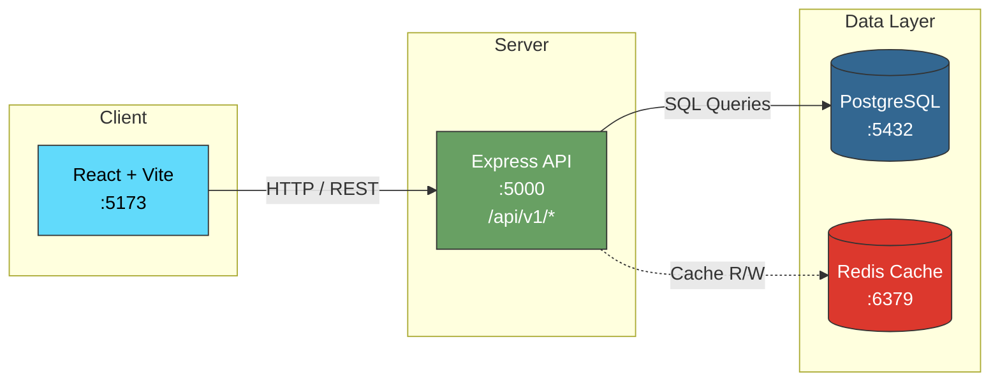
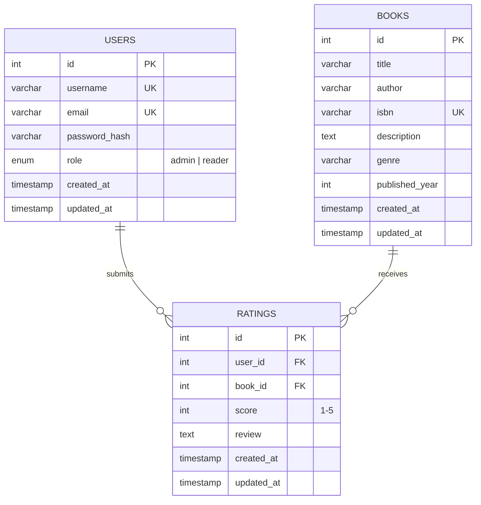
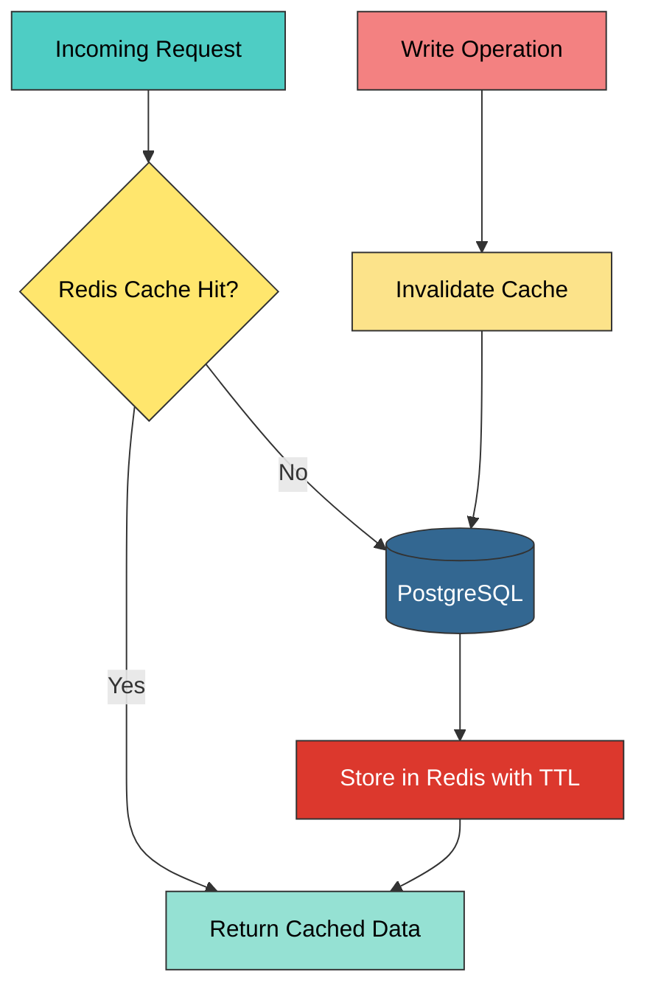

# 📚 BookShelf — Book Rating System

A **production-ready**, full-stack book rating platform built with **Node.js/Express**, **PostgreSQL**, **Redis**, and **React**. Features secure JWT-based authentication, role-based access control (RBAC), paginated APIs, and a modern responsive UI — all fully containerized with Docker.

---

## 🏗️ Architecture



### Design Principles

| Principle | Implementation |
|-----------|---------------|
| **Feature-based modularity** | Each domain (auth, books, ratings) is a self-contained module with its own routes, controllers, and validators |
| **API versioning** | All endpoints are namespaced under `/api/v1/` for forward compatibility |
| **Stateless auth** | JWT stored in HttpOnly cookies — no server-side session store required |
| **Separation of concerns** | Middleware handles auth, validation, and error formatting independently |

---

## 🛡️ Security Features

| Feature | Detail |
|---------|--------|
| 🔐 **JWT in HttpOnly Cookies** | Tokens are never exposed to JavaScript — mitigates XSS token theft |
| 🔑 **bcrypt Password Hashing** | Passwords hashed with a cost factor of 12 before storage |
| ✅ **Zod Input Validation** | Every request body and parameter is validated with strict Zod schemas |
| 🪖 **Helmet Security Headers** | Adds `X-Content-Type-Options`, `Strict-Transport-Security`, CSP, and more |
| 🚦 **Rate Limiting** | Configurable request limits to prevent brute-force and DDoS attacks |
| 🛡️ **Parameterized SQL** | All database queries use parameterized statements — immune to SQL injection |
| 👮 **RBAC Middleware** | Role checks (`admin`, `reader`) enforced at the route level |

---

## 🚀 Quick Start

### Prerequisites

- **Docker** & **Docker Compose** v2+
- **Node.js 20+** *(only for local development without Docker)*

### With Docker (Recommended)


# Build and start all services
docker-compose up --build
```

Once running:

| Service | URL |
|---------|-----|
| 🌐 Frontend | [http://localhost:5173](http://localhost:5173) |
| ⚙️ API | [http://localhost:5000/api/v1](http://localhost:5000/api/v1) |

> **Default Admin Account**
> Email: `admin@bookrating.com`
> Password: `Admin@123`

### Local Development

```bash
# 1 — Start only the databases via Docker
docker-compose up db redis

# 2 — Backend (new terminal)
cd server
cp .env.example .env      # configure your local env vars
npm install
npm run dev                # starts on :5000

# 3 — Frontend (new terminal)
cd client
npm install
npm run dev                # starts on :5173
```

---

## 📡 API Endpoints

All endpoints are prefixed with `/api/v1`.

### Auth

| Method | Path | Auth | Role | Description |
|--------|------|:----:|:----:|-------------|
| `POST` | `/auth/register` | ❌ | — | Register a new user (default role: reader) |
| `POST` | `/auth/login` | ❌ | — | Log in and receive an HttpOnly JWT cookie |
| `POST` | `/auth/logout` | ✅ | Any | Log out and clear cookie |
| `GET` | `/auth/me` | ✅ | Any | Get current user profile |

### Books

| Method | Path | Auth | Role | Description |
|--------|------|:----:|:----:|-------------|
| `GET` | `/books` | ❌ | — | List books (paginated, searchable, filterable) |
| `GET` | `/books/:id` | ❌ | — | Get a single book with average rating |
| `POST` | `/books` | ✅ | Admin | Create a new book |
| `PUT` | `/books/:id` | ✅ | Admin | Update an existing book |
| `DELETE` | `/books/:id` | ✅ | Admin | Delete a book and its ratings |

### Ratings

| Method | Path | Auth | Role | Description |
|--------|------|:----:|:----:|-------------|
| `GET` | `/books/:bookId/ratings` | ❌ | — | Get all ratings for a book |
| `POST` | `/books/:bookId/ratings` | ✅ | Reader | Submit a rating (one per user per book) |
| `PUT` | `/books/:bookId/ratings/:id` | ✅ | Owner | Update own rating |
| `DELETE` | `/books/:bookId/ratings/:id` | ✅ | Owner/Admin | Delete a rating |

> 📄 Full API documentation available in [`swagger.yaml`](./swagger.yaml) — import into [Swagger Editor](https://editor.swagger.io) for an interactive view.

---

## 🗄️ Database Schema



> **Constraint:** A unique index on `(user_id, book_id)` ensures each user can rate a book only once.

---

## 👥 Role-Based Access Control

| Action | 👑 Admin | 📖 Reader |
|--------|:--------:|:---------:|
| View books & ratings | ✅ | ✅ |
| Search & filter books | ✅ | ✅ |
| Create / Edit / Delete books | ✅ | ❌ |
| Submit ratings & reviews | ❌ | ✅ |
| Edit own ratings | ❌ | ✅ |
| Delete any rating | ✅ | ❌ |
| Delete own rating | ❌ | ✅ |

---

## 📐 Scaling Strategy

### Horizontal Scaling

- **Stateless JWT** design enables multiple API instances behind a load balancer
- No sticky sessions required — any instance can validate any token
- Docker Compose can scale the server: `docker-compose up --scale server=3`

### Database Scaling

- **Read replicas** for PostgreSQL to offload read-heavy rating queries
- **Connection pooling** with PgBouncer to manage high connection counts
- **Table partitioning** on the ratings table by `book_id` for large datasets

### Caching Strategy



- **Redis** caches book listings and aggregated rating data
- **Cache invalidation** triggered on every write (create / update / delete)
- **TTL-based expiry** prevents serving stale data beyond a configured window

### Infrastructure (Production)

| Component | Recommendation |
|-----------|---------------|
| Orchestration | Kubernetes with HPA for auto-scaling API pods |
| Database | Managed PostgreSQL (AWS RDS / GCP Cloud SQL) with automated backups |
| CDN | CloudFront / Cloud CDN for static frontend assets |
| CI/CD | GitHub Actions → Docker Build → K8s Deploy |
| Monitoring | Prometheus + Grafana for metrics; Sentry for error tracking |

---

## 🧰 Tech Stack

| Layer | Technology | Purpose |
|-------|-----------|---------|
| **Frontend** | React 18, Vite | SPA with fast HMR |
| **Styling** | CSS Modules / TailwindCSS | Responsive, utility-first styling |
| **HTTP Client** | Axios | API communication with cookie support |
| **Backend** | Node.js 20, Express 4 | RESTful API server |
| **Validation** | Zod | Runtime schema validation |
| **Authentication** | jsonwebtoken, bcrypt | JWT generation & password hashing |
| **Security** | Helmet, express-rate-limit, cors | HTTP hardening |
| **Database** | PostgreSQL 16 | Primary relational data store |
| **Caching** | Redis 7 | Response caching & rate limit store |
| **Containerization** | Docker, Docker Compose | Reproducible development & deployment |
| **API Docs** | OpenAPI 3.0.3 (Swagger) | Machine-readable API specification |

---

## 📁 Project Structure

```
assigment/
├── docker-compose.yml          # Full-stack orchestration
├── swagger.yaml                # OpenAPI 3.0.3 specification
├── README.md                   # You are here
│
├── server/                     # Express API
│   ├── Dockerfile
│   ├── .dockerignore
│   ├── .env.example
│   ├── init.sql                # DB schema + seed data
│   ├── package.json
│   └── src/
│       ├── index.js            # Entry point
│       ├── config/             # DB, Redis, env config
│       ├── middleware/          # auth, rbac, validate, errorHandler
│       ├── modules/
│       │   ├── auth/           # register, login, logout, me
│       │   ├── books/          # CRUD operations
│       │   └── ratings/        # Rating submissions
│       └── utils/              # Helpers, AppError class
│
└── client/                     # React + Vite
    ├── Dockerfile
    ├── .dockerignore
    ├── package.json
    ├── vite.config.js
    └── src/
        ├── main.jsx            # Entry point
        ├── App.jsx             # Root component + routing
        ├── api/                # Axios instance & API calls
        ├── components/         # Reusable UI components
        ├── context/            # Auth context provider
        ├── pages/              # Route-level page components
        └── styles/             # Global & component styles
```

---

## 🧪 Testing

```bash
# Run server tests
cd server
npm test

# Run client tests
cd client
npm test
```

---

## 📜 License

This project is licensed under the **MIT License** — see the [LICENSE](./LICENSE) file for details.

---

<p align="center">
  Built with ❤️ using Node.js, React, PostgreSQL & Docker
</p>
